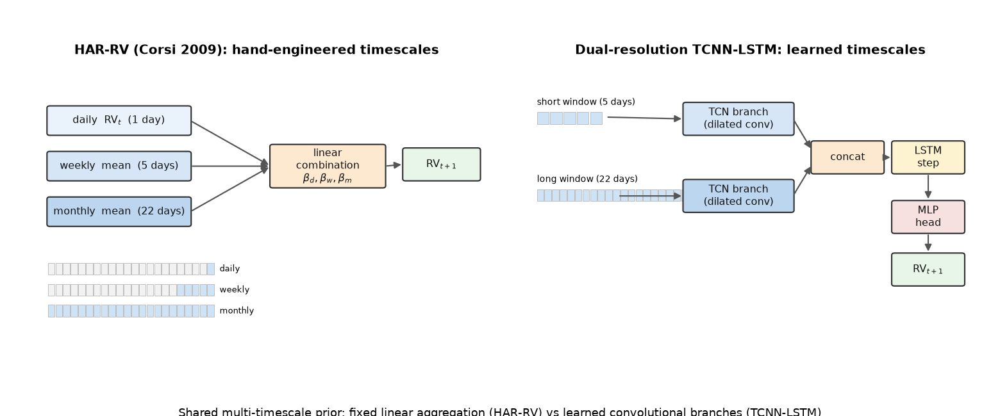
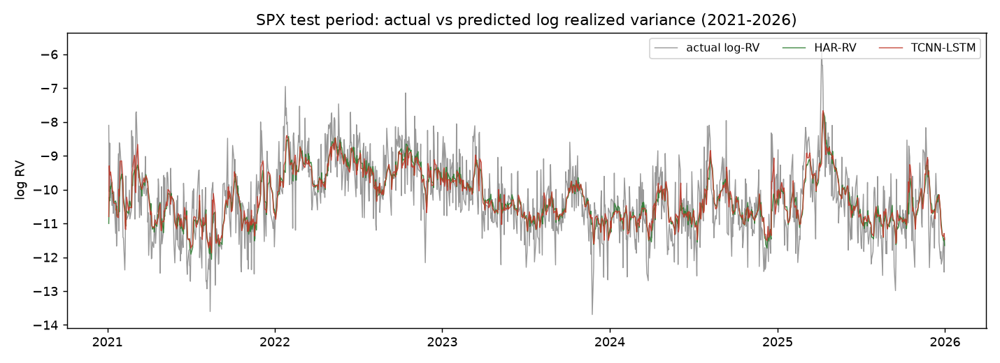
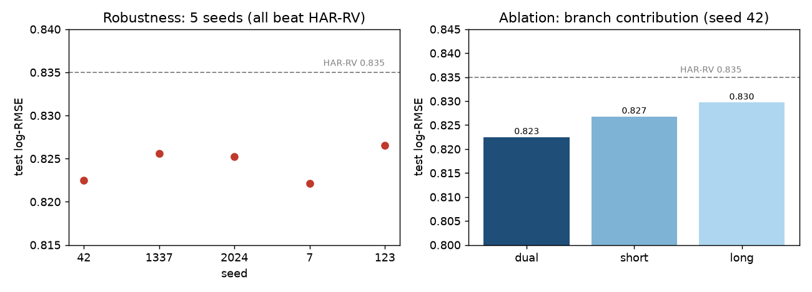

# Multi-Timescale Volatility Forecasting

Transferring a dual-resolution TCNN-LSTM from human activity recognition to one-day-ahead
S&P 500 realized-volatility forecasting. IE412 AI for Finance, UNIST, Spring 2026.



## Summary

Corsi's HAR-RV model forecasts realized volatility by linearly combining daily, weekly, and
monthly averages, a hand-engineered multi-timescale prior. That prior is structurally identical
to a dual-resolution hybrid TCNN-LSTM we co-proposed for human activity recognition
([Warnants et al., CEA 2026](#reference)), which fuses a short-context and a long-context branch.
This project transfers that architecture to volatility forecasting and tests, with the information
set held equal to HAR-RV, whether the learned version improves on the classical baselines.

## Result (SPX test set, 2021-2026)

| Model | Test log-RMSE | Test QLIKE | DM vs HAR-RV (SE) |
|-------|---------------|------------|-------------------|
| GARCH(1,1) | 0.884 | 0.454 | — |
| HAR-RV | 0.835 | 0.445 | — |
| **TCNN-LSTM** | **0.823** | 0.424 | **p = 0.013** |

The transferred model significantly beats HAR-RV under squared-error loss (Diebold-Mariano
p = 0.013), and the improvement is robust across 5 seeds (test log-RMSE 0.824 ± 0.002, 5/5 beat
HAR-RV). The QLIKE advantage is seed-dependent and reported as indicative only. A branch ablation
confirms the dual-resolution design contributes (dual 0.823 < short 0.827 < long 0.830). All
absolute RMSEs are bounded by the noise of the daily Garman-Klass proxy, so the relative comparison
is the informative one.

<p align="center">
  
  
</p>

## Report

The full write-up is [`report/main.pdf`](report/main.pdf).

## Reproduce

```bash
python -m venv .venv && source .venv/bin/activate
pip install -r requirements.txt

python src/data.py yfinance     # build the realized-variance proxy (parquet)
python src/baselines.py         # GARCH(1,1) + HAR-RV, logged to MLflow
python src/train.py             # dual-resolution TCNN-LSTM (seed 42)
python src/evaluate.py          # Diebold-Mariano tests, final_results.json
python src/experiments_extra.py # 5-seed robustness + branch ablation
```

Experiments are tracked with MLflow (`sqlite:///experiments/mlflow.db`); seeds are fixed and logged.
Data is downloaded from Yahoo Finance and is regenerable, so it is not checked in.

## Reference

Warnants, I., Diallo, M., Ortiz, F. J., Garrigós, F. J., Vera, J. A. (2026). *An efficient hybrid
HAR architecture for robust elderly AAL monitoring.* Simposio CEA de Robótica, Bioingeniería,
Visión por Computador y Automática Marina.

## AI tools

Claude Code (claude-opus-4-8) was used as a coding and writing assistant; all outputs were verified
by the author. See [`docs/ai_tool_log.md`](docs/ai_tool_log.md).
